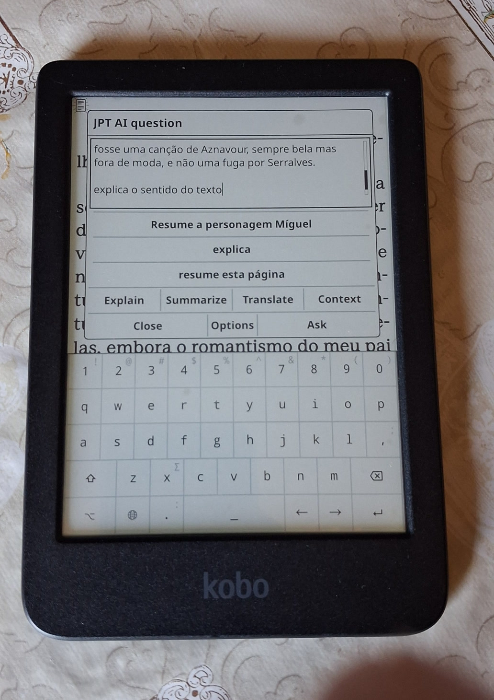

# JPT AI for KOReader

Your reading companion for KOReader: select any passage and ask AI to explain, summarize, translate, or discuss it in the context of the book.

<p align="center">
  
  
</p>

## Features

- Ask free-form questions about the current page, chapter, book, or selected text.
- Explain, summarize, and translate selected passages with one tap.
- Pick the primary and secondary reading contexts directly in the question dialog.
- Remember the chosen primary and secondary contexts for the next question.
- Adjust response font size, translation language, and response length from the plugin options. Choose **Short**, **Medium**, **Long**, or **Very long**; the setting is remembered for future questions.
- Send requests to an AI chat-completions endpoint that you configure yourself.

## Requirements

- A device running KOReader.
- Network access from KOReader.
- An API key and a compatible AI chat-completions endpoint.

## Installation

1. Copy this directory to KOReader's `plugins` directory as `jpt_ai.koplugin`.
2. Create the private configuration file:

   ```sh
   cp jpt_ai_config.example.lua jpt_ai_config.lua
   ```

3. Edit `jpt_ai_config.lua` with your endpoint, API key, model, and preferred request settings.
4. Restart KOReader.

`jpt_ai_config.lua` is deliberately excluded from Git, so your endpoint and API key remain local to your device.

## Configuration

`jpt_ai_config.lua` has this shape:

```lua
return {
    base_url = "https://your-api-host.example/v1/chat/completions",
    api_key = "your-api-key",
    model = "your-model-name",
    temperature = 0.2,
    max_output_tokens = 12000,
    request_timeout = 180,
    reasoning_effort = "low",
}
```

Use the URL required by your AI provider. Never commit `jpt_ai_config.lua` or share its API key.

## Using the plugin

- Open **JPT AI** from KOReader's tools menu or bind its `Open JPT AI` action to a gesture.
- Select text in a book and choose **JPT AI** from the selection menu.
- Use **Explain**, **Summarize**, or **Translate** for a quick response, or write a custom question.
- Use the **PRIMARY CONTEXT** and **SECONDARY CONTEXT** buttons to choose nearby pages, the current chapter, or the complete book. Primary **Pages (n)** uses an odd total (1, 3, 5, ...); secondary pages have their own saved setting and add text outside the primary page range. Tap the selected secondary option again to turn it off, so no secondary context is sent. A chapter cannot use a second chapter, and a complete book disables the secondary context.

## Privacy

The selected text and requested context are sent only to the endpoint configured in your private `jpt_ai_config.lua`. The plugin does not include an endpoint or API key in this repository.

## Compatibility

This plugin was tested on a **Kobo Clara BW (P365)** running KOReader. It is intended to work on any device that runs KOReader, although other devices and KOReader versions have not yet been tested.

## Repository contents

- `main.lua` — plugin implementation.
- `_meta.lua` — KOReader plugin metadata.
- `jpt_ai_config.example.lua` — safe private-configuration template.
